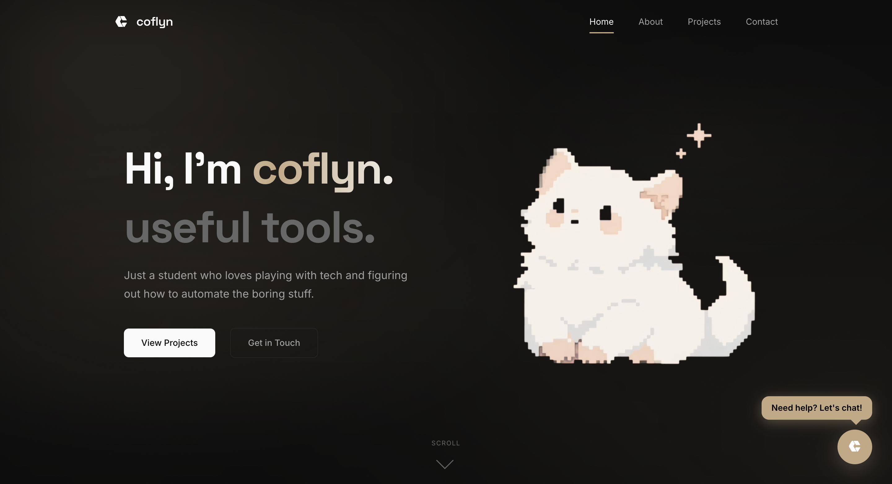

# coflyn.my.id

<p align="center">
  
</p>

<p align="center">
  
  
  
  
  
  
  
</p>

Welcome to the official repository of my personal portfolio. This project serves as a comprehensive showcase of my software development journey, featuring advanced automation tools, modern web & mobile experiences, and an intelligent AI assistant.

**Live Demo:** [coflyn.my.id](https://coflyn.my.id)

---

## Key Features

### Context-Aware AI Companion

Integrated with an advanced AI assistant powered by **Llama 3.3 70B** for an interactive, deep portfolio exploration experience.

- **Deep GitHub Integration:** The assistant can fetch and analyze READMEs, `package.json`, `requirements.txt`, and the **3 latest commits** from my repositories in real-time.
- **Intelligent Fallback Architecture:** Implements a cascading multi-model fallback system (Llama 3.3, Llama 3.1, Qwen) to guarantee 100% uptime against API rate limits, featuring smart UI handlers to elegantly mask reasoning models' internal chain-of-thought.
- **Live Status Integration:** Monitors real-time Discord presence (Online, Idle, or DND) and current Spotify tracks via Lanyard API.
- **Performance Optimized Typing:** Features a high-speed adaptive typing engine with smart auto-scroll that respects user interaction.
- **Personalized Easter Eggs:** Features fun conversational secrets, including interactive jokes, customized gaming interests, and philosophical insights.

### Intelligent Project Hub

A dynamically categorized grid showcasing projects fetched in real-time from GitHub.

- **Automatic Framework Classification:** Repositories are automatically analyzed and sorted into specific categories like **Node.js** (e.g. for Discord bots), **Next.js**, **React**, and **Laravel** with custom SVG icons.
- **Multi-Tag Discovery Filter:** Allows users to filter projects by language and tags simultaneously, making multi-language repos (e.g., Python scripts with `nodejs` tags) visible in multiple categories.
- **Premium Skew-Scale Transitions:** An elegant page entrance animation utilizing a left slide-in header and a liquid exponential skew-scale-up grid reveal, while maintaining smooth, native fade transitions for tag-filtering.

### Interactive "Meow-mento Mori" Mascot

A responsive pixel-art cat mascot that adds personality to the homepage.

- **Reactive Dialogue:** Features witty, tech-themed speech bubbles and "tickle" responses when clicked.
- **Dynamic Animations:** Implements squash-and-stretch physics for a satisfying, tactile feel.
- **Philosophical Touch:** Blends my "Coflyn" brand with the _Memento Mori_ philosophy in a playful way.

### Minimalist & Premium Dark UI

A bespoke dashboard-style design focusing on clean lines, sleek dark mode aesthetics, and harmonious CSS design tokens.

- **Glassmorphism:** A modern user interface utilizing frosted glass effects and refined typography.
- **Fluid Motion:** Implements smooth page transitions and element reveals via Framer Motion, Lenis smooth scrolling, and ScrollReveal.
- **Clean Browser Branding:** Unified metadata structure that removes redundant layout suffixes for a cleaner, modern tab appearance.

---

## Project Structure

```bash
Portfolio/
├── public/                     # Static assets & brand media
│   ├── coflyn.svg              # Unified brand logo & favicon
│   ├── preview.png             # Site OpenGraph preview image
│   └── cat.mp4                 # Hero cat mascot video asset
├── src/
│   ├── app/                    # Next.js App Router (Pages & API Routes)
│   │   ├── about/              # Bio, education timeline, tech stack & details
│   │   ├── contact/            # Glassmorphic contact form with Resend email API
│   │   ├── projects/           # Dynamic GitHub project hub with category filters
│   │   ├── api/
│   │   │   ├── chat/           # AI Assistant streaming endpoint (Groq / Llama)
│   │   │   └── contact/        # Contact email dispatch endpoint (Resend API)
│   │   ├── globals.css         # Core CSS design tokens, typography & variables
│   │   ├── layout.js           # Root layout, metadata & OpenGraph configuration
│   │   ├── HomeClient.js       # Homepage client logic (Mascot & Hero typewriter)
│   │   ├── not-found.js        # Custom 404 page boundary
│   │   └── error.js            # Custom runtime error boundary
│   ├── components/             # Reusable UI & Widget Components
│   │   ├── AIAssistant.js      # Floating AI chatbot drawer with status indicator
│   │   ├── LiveStatusCard.js   # Real-time Discord presence & Spotify activity
│   │   ├── Navbar.js           # Header navigation bar with brand logo
│   │   ├── Footer.js           # Footer with back-to-top trigger & copyright
│   │   ├── ProjectCard.js      # Repository project card with stars & tags
│   │   ├── ProjectList.js      # Category filter & search grid manager
│   │   ├── ProjectSkeleton.js  # Project list skeleton loading placeholder
│   │   ├── TechIcons.js        # Curated SVG vector icons for tech stack
│   │   ├── MagneticButton.js   # Cursor magnetic attraction wrapper
│   │   ├── PageTransition.js   # Page entrance transition animation
│   │   ├── ScrollReveal.js     # Viewport scroll reveal animation
│   │   ├── SectionHeader.js    # Standardized section header title
│   │   └── ClientProviders.js  # Smooth scroll provider wrapper
│   └── lib/                    # Core utilities & API integrations
│       ├── data.js             # Fallback static project dataset
│       └── github.js           # GitHub REST API client & tech classifier
```

---

## Technology Stack

Technologies used to build this portfolio web application:

- **Framework:** Next.js 16 (App Router);
- **Runtime Environment:** Node.js (API Routes & Serverless Backend)
- **Language / Core:** JavaScript (ES6+), HTML5
- **Styling:** Modular Vanilla CSS3 (CSS Variables & Glassmorphism System)
- **Animations & Motion:** Framer Motion & ScrollReveal
- **AI Companion Engine:** Groq Cloud API (Llama 3.3 70B)
- **Integrations:** Resend API (Email Dispatch), Lanyard API (Discord Rich Presence)
- **Deployment & Hosting:** Vercel Platform

---

## Contact

For collaborations or inquiries:

- **Web:** [coflyn.my.id/contact](https://coflyn.my.id/contact)
- **Instagram:** [@\_coflyn](https://www.instagram.com/_coflyn)
- **GitHub:** [@coflyn](https://github.com/coflyn)

Copyright 2026 — coflyn.
